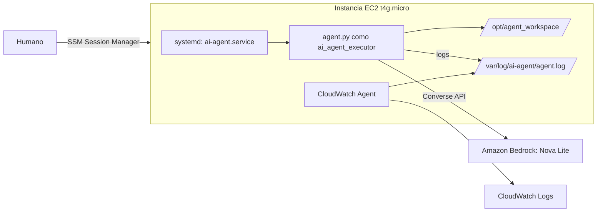

# Diseño: Agente en sandbox sobre EC2

## Visión general

## Mapeo de conceptos
| Paradigma | Linux/POSIX | AWS (EC2) |
|---|---|---|
| Identity Isolation | `useradd` | Instance Profile con mínimo privilegio + IMDSv2 |
| Workspace Sandboxing | `chmod 700` + systemd hardening | Security Group sin entrada |
| Self-Healing | `Restart=on-failure` | EC2 Auto Recovery (alarma) |
| Observability | archivo de log | CloudWatch Agent + Logs |
| Human in the Loop | acceso interactivo | SSM Session Manager |

## Decisiones
- **Sin lista negra como control de seguridad:** es fácil de eludir. El control real son usuario, permisos y systemd.
- **Logs a archivo** (`StandardOutput=append:`) para que el CloudWatch Agent los recoja de forma simple.
- **Código del agente propiedad de root** en `/opt/agent`, de solo lectura para el agente.

## Limitaciones conocidas
- El proceso que llama a Bedrock y el que ejecuta comandos son el mismo, por lo que un comando podría intentar leer credenciales del rol vía IMDS. Mejora propuesta: separar en dos procesos y restringir la red del ejecutor.
- SSM es acceso, no aprobación. Un flujo de aprobación real requiere, por ejemplo, Step Functions con task tokens.
- Verificar que la subred tenga salida a Internet o VPC endpoints.